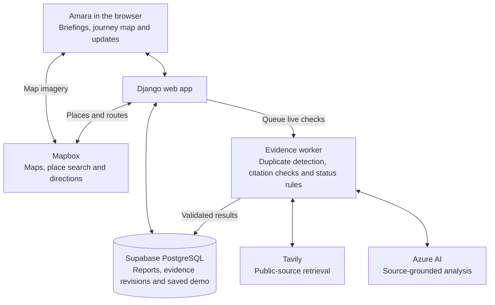

# Amara

### A clearer way home.

Amara is an AI-assisted journey companion that helps people make sense of local reports before and during a trip. It brings routes, source-linked briefings, and relevant updates into one place—showing what the evidence supports, what conflicts, and what is still unknown.

**[Open Amara →](https://amara.apps.thalesops.com/)** · Hosted on **ThalesOps**

## Why Amara?

A roadblock message gets forwarded three times. A roadworks update has no observation time. Another report says the road has cleared. Which information should you use before leaving?

Amara starts with a simple distinction: **repeated messages are not independent confirmation.** Instead of turning every report into a confident alert, it helps you inspect the evidence behind it.

The prototype focuses on journeys around **Yaba, Lagos**, with a small, inspectable experience: plan a route, understand nearby reports, and see when the evidence changes.

## What you can do

- **Plan a journey:** search places and view walking or driving directions.
- **Follow the route:** use the 3D map or the automatic 2D fallback on browsers without WebGL.
- **Read the evidence:** open source-linked briefings with observation times, supporting reports, contradictions, and missing information.
- **Receive relevant updates:** see report revisions tied to your route or followed area, with controls to read, dismiss, or mute automatic updates.
- **Try the journey demo:** watch a complete, labelled replay without a phone or location permission.
- **Run an AI check:** search public sources or use controlled example reports to explore how new evidence changes a briefing.

## How it works

### 1. Choose a route or a report to investigate

For a journey, Amara uses Mapbox to find places and calculate walking or driving routes. You can also open **Check reports** to investigate a question without starting a trip.

### 2. Gather the available evidence

For public-source checks, Tavily retrieves relevant web reports. Amara keeps source references and available timing information, and detects duplicate inputs. Fictional demo reports are kept separate from public-source cases.

### 3. Use AI to compare the reports

Azure AI examines the claims, locations, observation times, relationships between sources, and contradictions. It produces a concise analysis grounded in report references and source quotations.

AI helps explain the evidence; it does not independently verify the road. Before publishing, Amara checks the model's references and quotations, then applies its own evidence rules:

| Status | Meaning |
| --- | --- |
| **Unconfirmed** | Independent support or matching observation times are missing, or the evidence conflicts. |
| **Corroborated** | Qualifying independent sources support the claim within a matching observation window, with no unresolved opposing evidence. |
| **Confirmed by [source]** | A specifically configured authority explicitly confirms the claim in primary evidence. No authorities are configured by default. |

### 4. Publish a briefing and relevant updates

Validated results are saved as versioned evidence records. During a live journey, Amara checks whether a revision is relevant to the route or followed area before displaying an update. You can open the supporting evidence rather than relying on the headline alone.

New evidence can strengthen a claim, introduce uncertainty, or correct an earlier update. Repeated polling or reopening the page should not produce duplicate alerts.

## Try it

1. Open **[the journey demo](https://amara.apps.thalesops.com/journey/)**.
2. Click **Start the journey**.
3. Watch the moving marker, travelled trail, and gradually appearing incident updates.
4. Click **Why this update?** to inspect the evidence. **Continue journey** returns you to the replay.

### Saved demo and live analysis

The default **Demo replay** lasts about **80 seconds**. The journey and reports are simulated; the routes come from Mapbox and the saved analyses were genuinely generated by the AI pipeline beforehand.

Reports progress through **Received → Checking sources → AI-reviewed** over **3.5 replay seconds**. That interval is presentation timing, not a live AI response-time claim. Playback loads the saved scenario without fresh AI, news, or directions requests; map imagery may still load over the network.

To try fresh processing, end the replay and open **[Check reports](https://amara.apps.thalesops.com/evidence/)**. Choose **Search public sources**, or **Start a new AI demonstration** to test controlled reports with independent or conflicting evidence. Live checks use actual retrieval and model response times.

## Architecture

The web app serves pages and data; a background worker handles live evidence checks. In replay mode, the app reads the prepared scenario from Supabase rather than invoking that live pipeline.

### Technology

| Layer | Technology |
| --- | --- |
| Application | Django and server-rendered templates |
| Interface | Tailwind CSS, vanilla JavaScript, GSAP |
| Maps and routing | Mapbox, with a non-WebGL 2D fallback |
| Database | Supabase PostgreSQL |
| Public-source retrieval | Tavily |
| AI analysis | Azure AI Foundry |
| Hosting | ThalesOps |

## Scope and next steps

Amara is a working prototype for understanding journey information, not a guarantee of safe travel. **AI-reviewed does not mean verified true, and no reports does not mean a road is clear.** Public-source coverage can be incomplete or out of date.

Real GPS is an optional foreground mode. Location permission is requested separately, and GPS fixes are kept in browser memory rather than stored as a movement history. Route coordinates are sent to Mapbox for directions.

Next steps are to test with commuters, improve local coverage through firsthand reports from shopkeepers, drivers, and market leaders, and evaluate whether the briefings help people make better-informed journey decisions.

## Data attribution

Map imagery and directions are provided by Mapbox. Local landmark references include [Yaba College of Technology](https://www.openstreetmap.org/way/671850885) and [Alagomeji bus stop](https://www.openstreetmap.org/node/1513671680), using data © OpenStreetMap contributors under [ODbL](https://www.openstreetmap.org/copyright).
